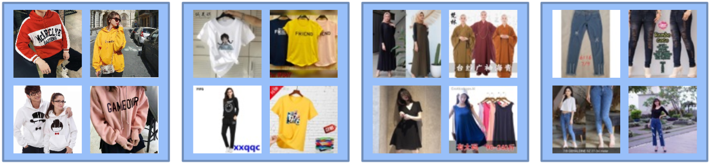

# NTU-ML-Introduction-Final

### 服飾影像分類 kaggle 競賽
- Dataset: images of clothes on online stores
- Task: Multi-Class Classification
- DATA INFORMATION:
  - Type: 0~3
  - Data amount:
    - 0: 2000
    - 1: 2000
    - 2: 1200
    - 3: 800
    - Total: 6000
  - Image size: unrestricted
  

***
名次: 5/36

Keras code: [final_1](final_1.ipynb),[final_2](final_2.ipynb)

書面簡報: [競賽報告pdf](期末競賽報告.pdf)
